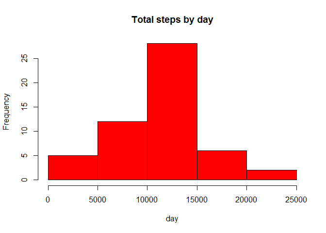

# Reproducible Research: Peer Assessment 1


## Loading and preprocessing the data


```r
analysis <- read.csv("activity.csv", colClasses = c("numeric", "character","numeric"))
head(analysis)
```

```
##   steps       date interval
## 1    NA 2012-10-01        0
## 2    NA 2012-10-01        5
## 3    NA 2012-10-01       10
## 4    NA 2012-10-01       15
## 5    NA 2012-10-01       20
## 6    NA 2012-10-01       25
```

```r
library(lattice)
```

## What is mean total number of steps taken per day?


```r
TotalSteps <- aggregate(steps ~ date, data = analysis, sum,
na.rm = TRUE)
```

The histogram of the total number of steps taken each day is:


```r
hist(TotalSteps$steps, main = "Total steps by day", xlab =
"day", col = "red")
```

 

The mean is:

```r
mean(TotalSteps$steps)
```

```
## [1] 10766.19
```

The median is:

```r
median(TotalSteps$steps)
```

```
## [1] 10765
```

## What is the average daily activity pattern?

Make a time series plot (i.e. type = "l") of the 5minute interval (xaxis) and the average
number of steps taken, averaged across all days (yaxis)

Get the mean of steps and time series plot

```r
timeSeries <- tapply(analysis$steps, analysis$interval,
mean, na.rm = TRUE)
```

The time series plot is:

```r
plot(row.names(timeSeries), timeSeries, type = "l", xlab= "5-min interval",
ylab = "Average across all Days", main = "Average number of steps taken", col = "red")
```

 

Which 5minute interval, on average across all the days in the dataset, contains the maximum number of steps?


```r
maxSteps <- which.max(timeSeries)
names(maxSteps)
```

```
## [1] "835"
```
## Imputing missing values

Calculate and report the total number of missing values in the dataset (i.e. the total number of rows with NAs)

```r
activityNA <- sum(is.na(analysis))
activityNA
```

```
## [1] 2304
```

Devise a strategy for filling in all of the missing values in the dataset. The strategy does not need to be sophisticated. For example, you could use the mean/median for that day, or the mean for that 5-minute interval, etc.

NA is replaced by the mean in 5 min interval

```r
stepsAverage <- aggregate(steps ~ interval, data = analysis, FUN = mean)
fillNA <- numeric()
for (i in 1:nrow(analysis)) {
obs <- analysis[i, ]
if (is.na(obs$steps)) {
steps <- subset(stepsAverage, interval ==
obs$interval)$steps
} else {
steps <- obs$steps
}
fillNA <- c(fillNA, steps)
}
```

Create a new dataset that is equal to the original dataset but with the missing data filled in.

```r
newWithNA <- analysis
newWithNA$steps <- fillNA
```

Make a histogram of the total number of steps taken each day and Calculate and report the mean and median total number of steps taken per day. Do these values differ from the estimates from the first part of the assignment? What is the impact of imputing missing data on the estimates of the total daily number of steps?

```r
stepsTotalNA <- aggregate(steps ~ date, data = newWithNA,sum, na.rm = TRUE)
```
The Histogram is

```r
hist(stepsTotalNA$steps, main = "Total steps by day", xlab ="day", col = "blue")
```

 

And the mean and median this time are:

```r
mean(stepsTotalNA$steps)
```

```
## [1] 10766.19
```

```r
median(stepsTotalNA$steps)
```

```
## [1] 10766.19
```
After replacing the NA values with the mean, the values (obviously) has differed
## Are there differences in activity patterns between weekdays and weekends?
